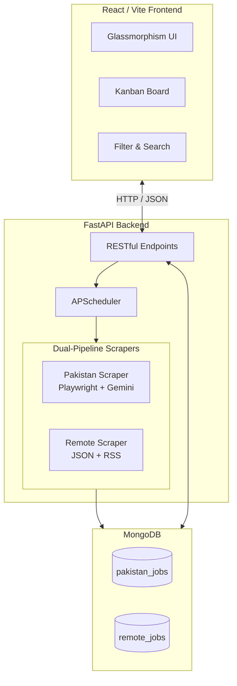

<div align="center">
  
  <h1 align="center">AI JobTracker Portal</h1>

  <p align="center">
    A Dual-Pipeline Automated Job Board Scraping & Tracking System.
    <br />
    <br />
    <a href="#features">Features</a> ·
    <a href="#architecture">Architecture</a> ·
    <a href="#getting-started">Getting Started</a>
  </p>
</div>

---

## 🌟 Overview

**AI JobTracker** is an automated, AI-powered system designed to scrape, extract, and track job postings from across the web. It features a dual-pipeline architecture pulling both localized jobs (Pakistan) and Worldwide Remote jobs into a unified, glassmorphic Kanban dashboard.

By leveraging **Playwright** for rendering dynamic Single Page Applications (SPAs) and **Google's Gemini 3.1 Flash Lite API** for structured JSON data extraction, this system intelligently bypasses obfuscated HTML and extracts accurate metadata (Titles, Apply Links, Salaries) that traditional HTML parsers often miss.

---

## ✨ Features

- **🧠 AI-Powered Extraction**: Uses Google Gemini to parse messy, dynamically loaded webpage text into structured JSON.
- **🚀 Dual Pipeline**:
  - **Pakistan Pipeline**: Deep-scrapes Rozee.pk and Mustakbil using headless Chromium.
  - **Remote Pipeline**: Pulls direct JSON APIs from Remotive and RSS feeds from WeWorkRemotely.
- **⏰ Automated Scheduling**: Built-in APScheduler runs daily scrapes in the background to ensure fresh data.
- **🎨 Premium Frontend**: A responsive, dark glassmorphism React dashboard built with Vite.
- **📋 Kanban Board Tracking**: Drag-and-drop jobs between statuses (Inbox, Applied, Interviewing, Offer, Rejected, Ghosted).
- **🔍 Smart Filtering**: Real-time filtering by Job Title, Company, City, and Remote vs. Onsite.

---

## 🏗️ Architecture



---

## 🚀 Getting Started

Follow these instructions to get the project up and running on your local machine.

### Prerequisites

- **Node.js** (v18+)
- **Python** (3.10+)
- **MongoDB** (Local instance running on `localhost:27017` or MongoDB Atlas URI)
- **Google Gemini API Key** (Free tier available at [Google AI Studio](https://aistudio.google.com/))

### 1. Clone the Repository
```cmd
git clone https://github.com/yourusername/ai-jobtracker.git
cd ai-jobtracker
```

### 2. Backend Setup
The backend runs on Python/FastAPI.

```cmd
cd backend
python -m venv venv
venv\Scripts\activate
pip install -r requirements.txt
playwright install chromium
```

#### Environment Variables
Create a `.env` file inside the `backend/` directory with the following variables:

```env
# MongoDB Connection
MONGO_URI=mongodb://localhost:27017
DB_NAME=job_portal

# AI Studio Key for Job Extraction
GEMINI_API_KEY=your_gemini_api_key_here

# Time to run the automated daily scrape (UTC)
SCRAPE_TIME=08:00
```

#### Start the Backend Server
```cmd
uvicorn main:app --reload
```
*The API will be available at `http://localhost:8000` and Swagger docs at `http://localhost:8000/docs`.*

### 3. Frontend Setup
The frontend is a Vite-powered React application.

```cmd
cd ../frontend
npm install
```

#### Start the Frontend Server
```cmd
npm run dev
```
*The dashboard will be available at `http://localhost:5173`.*

---

## 🛠️ Tech Stack

- **Frontend:** React, Vite, CSS Modules (Glassmorphism), Lucide Icons
- **Backend:** Python, FastAPI, Uvicorn, APScheduler
- **Scraping:** Playwright, BeautifulSoup4, httpx
- **AI Processing:** Google Generative AI (`gemini-3.1-flash-lite`)
- **Database:** MongoDB, Motor (Async)

---

## 📝 License

Distributed under the MIT License.
